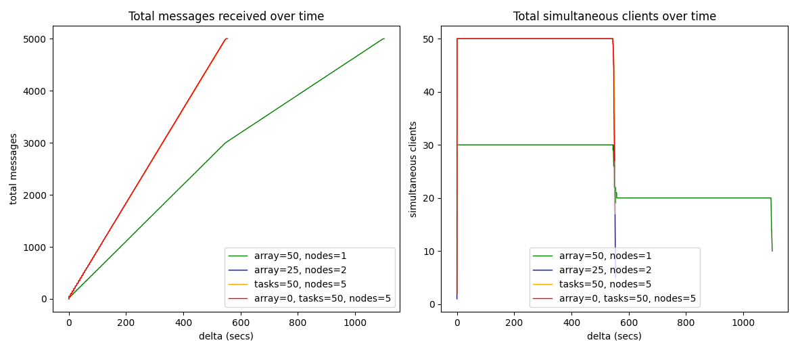

## How to run locally

- start server `python3 ~/Workspace/py/chat/srv.py --port 8989`
- start alice `python3 ~/Workspace/py/chat/cli.py --port 8989 alice`
- start bob `python3 ~/Workspace/py/chat/cli.py --port 8989 bob`


## How to run in SLURM cluster

Reserve a node to host the srv

`srun --job-name=srvchat --time=05:00:00 --partition=besteffort --qos=besteffort --ntasks=1 --cpus-per-task=1 --mem=512M --pty bash -l`

Then, once inside of it run

```bash
PORT=$(python3 -c 'import socket; s=socket.socket(); s.bind(("", 0)); print(s.getsockname()[1]); s.close()')
echo "Starting srv on port $PORT"
scontrol update JobId="$SLURM_JOB_ID" Comment="$PORT"
$HOME/miniconda3/envs/testing/bin/python3 $HOME/Workspace/_tmp/slurm-chat/srv.py --port $PORT
```

Now, run the parallel bots with

`sbatch -J botbatch ~/Workspace/_tmp/slurm-chat/bots.sbatch 10`


## Two paradigms: `Array job` vs `ntasks`



- If you use array: the (sub)jobs may start at different times
- If you use tasks: they're gonna start all at the same time

At the end, it all comes down to this: if your job is [embarrassingly parallel](https://en.wikipedia.org/wiki/Embarrassingly_parallel),
you can use array or ntasks, otherwise you should be using ntasks. More info
[here](https://stackoverflow.com/questions/53423544/slurm-question-array-job-vs-srun-in-a-sbatch).

### array job

Example:

```bash
#SBATCH --nodes=2
#SBATCH --array=1-50
```

* You cannot set `--array` greater than 50 (otherwise it'll return 
  `sbatch: error: QOSMaxSubmitJobPerUserLimit`)
* In `normal` QoS only 30 (sub)jobs will run in parallel. If you set `--array` 
  to 50, then it will run 30 processes, and then 20.
* If you run with `--array=1-50` and set sbatch bots to produce 10 msgs you will get:
    - First 30 parallel processes, and then 20 parallel procesess
    - 50 log files in total (one for each bot)
    - 10 msgs * 50 = 500 msgs
    - slurm will distribute all array-jobs ("subjobs") into different nodes
* If you set `--array=1-2` and `--nodes=2` you will get:
    - 4 processes running
    - 2 subjobs (e.g., `3607061_1` + `3607061_2`) but running in two different
      node lists (e.g., `node[15-16]` + `node[18-19]`)
* If you set `--array=1-50` and `--nodes=2` you will get:
    - 60 processes running in parallel (n=60 in srv)
    - First 30+30=60, and then 20+20=40 parallel processes
    - (50 subjobs) * (2 nodes each) * (10 msgs each) = 1000 msgs
* If you set `--array=1-50` and `--nodes=2` but **without** `srun`, you will get:
    - First 30 then 20 parallel processes.
    - I.e., for each subjob, one node is wasted doing nothing.
    - (30+20 subjobs) * (10 msgs each) = 500 msgs
* If you set `--mail-type=END` you will get only one email. E.g.,
  `Slurm Array Summary Job_id=3607247_* (3607247) Name=botbatch Ended, COMPLETED`

This is how array jobs are shown when running squeue:

```bash
    JOBID     NAME          START_TIME    STATE NODES NODELIST(REASON)
3604086_0 botbatch 2024-05-26T01:07:47  RUNNING     1 node05
3604086_4 botbatch 2024-05-26T01:07:47  RUNNING     1 node05
(...)
3604086_1 botbatch 2024-05-26T01:07:47  RUNNING     1 node15
3604086_1 botbatch 2024-05-26T01:07:47  RUNNING     1 node15
```

In summary:
  - Always use `srun`
  - For each array-job/sub-job * for each node: run the command of `srun`
  - `srun` will distribute one instance of the cmd for each node assigned to the
    (sub)job.


## ntasks (+ srun)

**If you use tasks don't forget launching your binaries with `srun` !!!!**

Example:

```bash
#SBATCH --ntasks=50
#SBATCH --nodes=5 # distribute 50 tasks (procs) across 5 nodes
srun CMD
```

Notice that if you use something like this:

```bash
#SBATCH --ntasks=50
#SBATCH --cpus-per-task=1
```

You'll get `QOSMaxCpuPerNode` since there are no CPU with 50 cores.

But if we add `#SBATCH --nodes=5` like this:

```bash
#SBATCH --ntasks=50
#SBATCH --nodes=5
#SBATCH --cpus-per-task=1
```

It'll be fine.

Notice: when running binaries with `ntasks+srun` the logs of all the tasks are
merged together in a single `.log` file (i.e., the job's log file).
Plus, it won't show the prints/logged-lines in real-time, but only once all taks
are done.


## About SLURM info variables

### When running with `--array=1-n` and `--nodes=m`

1. ${SLURM_ARRAY_JOB_ID} it's the same for all `array-jobs`.
   It's the "base id".
   E.g., let's say `SLURM_ARRAY_JOB_ID` is `1000`

2. Then, if we executed `--array=1-n` we'll get all these (sub)jobs
   `1000, 1001, 1002, 1003, ..., 100(n-1)`
   ${SLURM_JOB_ID} will be one of these.

3. Finally, ${SLURM_ARRAY_TASK_ID} is the (sub)job ix.
   So SLURM_ARRAY_TASK_ID is in [1,n]
   I.e., `SLURM_ARRAY_JOB_ID` + `SLURM_ARRAY_TASK_ID` = `SLURM_JOB_ID`
   E.g., `1000`               + `5`                   = `1005`

in summary, (and counterintuitively):
  when using `--array=1-n`
  - ${SLURM_ARRAY_JOB_ID} is the base/father ID 1000 ("shared" in all (sub)jobs)
  - ${SLURM_ARRAY_TASK_ID} is the (sub)job index
  - ${SLURM_JOB_ID} = SLURM_ARRAY_JOB_ID + SLURM_ARRAY_TASK_ID

### When running with `--nodes=m` and `--ntasks=n`

There's only one job, with just one ID

- SLURM_ARRAY_JOB_ID = ""
- SLURM_JOB_ID = ID
- SLURM_ARRAY_TASK_ID = ""


## About cluster.uy architecture

On its website, cluster.uy shows this info:

```
node            CPU_type        cores ‡ mem_node gpu_node        disk `/scratch`
node[01-14][17] Xeon Gold 6138  40      128 GB   NVIDIA P100     300 GB SSD
node[15][16]    Xeon Gold 6138  40      128 GB   NVIDIA A100     300 GB SSD
node[26-28]     Xeon Gold 6138  40      128 GB   -               300 GB SSD
node[18-22]     Xeon Gold 6138  40      128 GB   NVIDIA P100 x 2 300 GB SSD
node23          Xeon Gold 6138  40      128 GB   NVIDIA P100 x 3 300 GB SSD
node[24-25]     Xeon Gold 6138  40      512 GB   -               300 GB SSD
node31          AMD EPYC  7642  96      256 GB   -               150 GB SSD
```

‡ That information is kind of misleading. E.g., Xeon Gold 6138 has 20 physical
cores, and 40 (physical) threads, but only if Hyper-Threading is enabled.
In theory, cluster.uy DOES NOT has HT enabled (to the date), so the actual 
number of cores per cpu should be half for each of them. Same for AMD Epyc 7642 
which in reality it only has 48 physical cores.

Notice: Max possible memory requested for a single job is 125 GiB, 503 GiB or 
251 GiB.

And thus,

```
number_nodes * cpus_per_node = total_cpus
((14-1+1)+1) *      (20)     = 300
(2)          *      (20)     = 40
(28-26+1)    *      (20)     = 60
(22-18+1)    *      (20)     = 100
(1)          *      (20)     = 20
(25-24+1)    *      (20)     = 40
(1)          *      (96)     = 48
-------------                  -------
29 nodes                       608 = (1216 / 2) cpus
```


### Usage

- You can list all nodes and its status with `sinfo -Nel`

- Or inspect a single node with `scontrol show node <node_name>`

On cluster.uy's official Telegram channel it shows this info:

```
alloc       6 nodes (240 CPUs)
drain       1 nodes (40 CPUs)
idle        6 nodes (296 CPUs)
mix        16 nodes (728 CPUs)
Total      29 nodes (1304 CPUs) 👈 which is bigger than 1216 🤷‍♂️
```

- As of today, (Mat 26th, 2024) the cluster usage is at 80% for cpus, and 79% 
  for gpus.

- These are the today's top 10 single user cpu-hours consumption in the last 24h:
  `34944, 11237, 10680, 10248, 9780, 9542, 7368, 5400, 5040, 2433`

- I.e., `1456, 468, 445, 427, 407, 397, 307, 225, 210, 101` cores used per hour.


### Comparison

- Noam Brown used 600 nodes, each equipped with 28 cores, over a period of 40 
  days to train Libratus. That is, `600 nodes * 28 cores * 40 days * 24 hours = 16M core-hours`.
  I.e., `16800` cores per hour.

- The system where Pluribus was trained used `(n nodes * c cores) * d days * 24 hours = 12.4k core-hours`.
  where `n*c = 64`, so we can derive that it was trained for about 8 days.
  I.e., `64` cores per hour.

- ReBeL used 7.5k core-hours, only one single machine for training and up to 
  128 machines with 8 GPUs each for data generation (i.e., self-play).


## VSCODE

```bash
PASSWORD=1234
PORT=$(python -c 'import socket; s=socket.socket(); s.bind(("", 0)); print(s.getsockname()[1]); s.close()')
echo "running on: $(hostname):${PORT}"
echo "tunel: 'ssh -L ${PORT}:$(hostname):${PORT} $(whoami)@cluster.uy'"
singularity exec --bind "$HOME/.local:/home/coder/.local" --bind "$HOME/.config:/home/coder/.config" --bind "$PWD:/home/coder/project" --env "DOCKER_USER=$USER" --env "PASSWORD=$PASSWORD" code-server_latest.sif /bin/bash -c "code-server --bind-addr 0.0.0.0:$PORT --auth password --disable-telemetry"
```

ssh tunnel

```
ssh -L 33584:node05.datos.cluster.uy:33584 juan.filevich@cluster.uy
```

then access `localhost:33584` in your browser