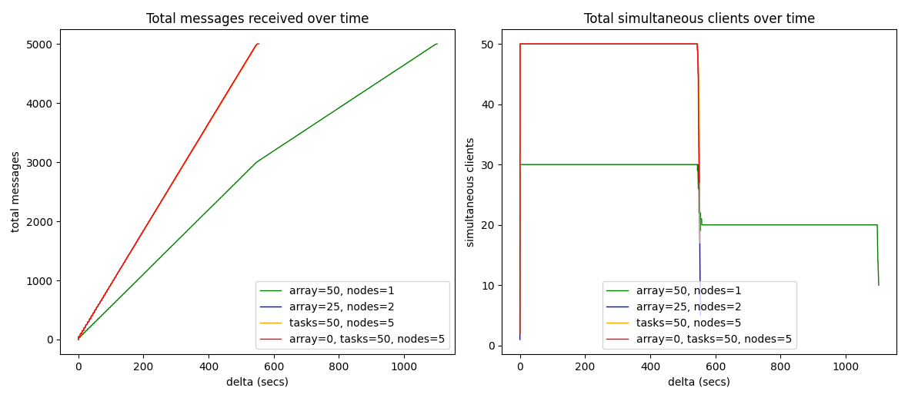
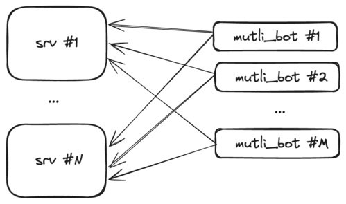

# Lesson 1


## How to run locally

- start server `python3 lesson-1/srv.py --port 8989`
- start alice `python3 lesson-1/cli.py --port 8989 alice`
- start bob `python3 lesson-1/cli.py --port 8989 bob`


## How to run in SLURM cluster

Reserve a node to host the srv

`srun --job-name=srvchat --time=05:00:00 --partition=besteffort --qos=besteffort --ntasks=1 --cpus-per-task=1 --mem=512M --pty bash -l`

Then, once inside of it run

```bash
PORT=$(python3 -c 'import socket; s=socket.socket(); s.bind(("", 0)); print(s.getsockname()[1]); s.close()')
echo "Starting srv on port $PORT"
scontrol update JobId="$SLURM_JOB_ID" Comment="$PORT"
$HOME/miniconda3/envs/testing/bin/python3 $HOME/Workspace/_tmp/slurm-chat/lesson-1/srv.py --port $PORT
```

Now, run the parallel bots with

`sbatch -J botbatch ~/Workspace/_tmp/slurm-chat/lesson-1/bots.sbatch 10`


## Two paradigms: `Array job` vs `ntasks`



- If you use array: the (sub)jobs may start at different times
- If you use tasks: they're gonna start all at the same time

At the end, it all comes down to this: if your job is [embarrassingly parallel](https://en.wikipedia.org/wiki/Embarrassingly_parallel),
you can use array or ntasks, otherwise you should be using ntasks. More info
[here](https://stackoverflow.com/questions/53423544/slurm-question-array-job-vs-srun-in-a-sbatch).

### array job

Example:

```bash
#SBATCH --nodes=2
#SBATCH --array=1-50
```

* You cannot set `--array` greater than 50 (otherwise it'll return 
  `sbatch: error: QOSMaxSubmitJobPerUserLimit`)
* In `normal` QoS only 30 (sub)jobs will run in parallel. If you set `--array` 
  to 50, then it will run 30 processes, and then 20.
* If you run with `--array=1-50` and set sbatch bots to produce 10 msgs you will get:
    - First 30 parallel processes, and then 20 parallel procesess
    - 50 log files in total (one for each bot)
    - 10 msgs * 50 = 500 msgs
    - slurm will distribute all array-jobs ("subjobs") into different nodes
* If you set `--array=1-2` and `--nodes=2` you will get:
    - 4 processes running
    - 2 subjobs (e.g., `3607061_1` + `3607061_2`) but running in two different
      node lists (e.g., `node[15-16]` + `node[18-19]`)
* If you set `--array=1-50` and `--nodes=2` you will get:
    - 60 processes running in parallel (n=60 in srv)
    - First 30+30=60, and then 20+20=40 parallel processes
    - (50 subjobs) * (2 nodes each) * (10 msgs each) = 1000 msgs
* If you set `--array=1-50` and `--nodes=2` but **without** `srun`, you will get:
    - First 30 then 20 parallel processes.
    - I.e., for each subjob, one node is wasted doing nothing.
    - (30+20 subjobs) * (10 msgs each) = 500 msgs
* If you set `--mail-type=END` you will get only one email. E.g.,
  `Slurm Array Summary Job_id=3607247_* (3607247) Name=botbatch Ended, COMPLETED`

This is how array jobs are shown when running squeue:

```bash
    JOBID     NAME          START_TIME    STATE NODES NODELIST(REASON)
3604086_0 botbatch 2024-05-26T01:07:47  RUNNING     1 node05
3604086_4 botbatch 2024-05-26T01:07:47  RUNNING     1 node05
(...)
3604086_1 botbatch 2024-05-26T01:07:47  RUNNING     1 node15
3604086_1 botbatch 2024-05-26T01:07:47  RUNNING     1 node15
```

In summary:
  - Always use `srun`
  - For each array-job/sub-job * for each node: run the command of `srun`
  - `srun` will distribute one instance of the cmd for each node assigned to the
    (sub)job.


## ntasks (+ srun)

**If you use tasks don't forget launching your binaries with `srun` !!!!**

Example:

```bash
#SBATCH --ntasks=50
#SBATCH --nodes=5 # distribute 50 tasks (procs) across 5 nodes
srun CMD
```

Notice that if you use something like this:

```bash
#SBATCH --ntasks=50
#SBATCH --cpus-per-task=1
```

You'll get `QOSMaxCpuPerNode` since there are no CPU with 50 cores.

But if we add `#SBATCH --nodes=5` like this:

```bash
#SBATCH --ntasks=50
#SBATCH --nodes=5
#SBATCH --cpus-per-task=1
```

It'll be fine.

Notice: when running binaries with `ntasks+srun` the logs of all the tasks are
merged together in a single `.log` file (i.e., the job's log file).
Plus, it won't show the prints/logged-lines in real-time, but only once all taks
are done.


## About SLURM info variables

### When running with `--array=1-n` and `--nodes=m`

1. ${SLURM_ARRAY_JOB_ID} it's the same for all `array-jobs`.
   It's the "base id".
   E.g., let's say `SLURM_ARRAY_JOB_ID` is `1000`

2. Then, if we executed `--array=1-n` we'll get all these (sub)jobs
   `1000, 1001, 1002, 1003, ..., 100(n-1)`
   ${SLURM_JOB_ID} will be one of these.

3. Finally, ${SLURM_ARRAY_TASK_ID} is the (sub)job ix.
   So SLURM_ARRAY_TASK_ID is in [1,n]
   I.e., `SLURM_ARRAY_JOB_ID` + `SLURM_ARRAY_TASK_ID` = `SLURM_JOB_ID`
   E.g., `1000`               + `5`                   = `1005`

in summary, (and counterintuitively):
  when using `--array=1-n`
  - ${SLURM_ARRAY_JOB_ID} is the base/father ID 1000 ("shared" in all (sub)jobs)
  - ${SLURM_ARRAY_TASK_ID} is the (sub)job index
  - ${SLURM_JOB_ID} = SLURM_ARRAY_JOB_ID + SLURM_ARRAY_TASK_ID

### When running with `--nodes=m` and `--ntasks=n`

There's only one job, with just one ID

- SLURM_ARRAY_JOB_ID = ""
- SLURM_JOB_ID = ID
- SLURM_ARRAY_TASK_ID = ""

# Lesson 2

In this lesson we'll try to use multiple servers at the same time. We'll adapt
`bot.py` to `multi_bot.py` so that it can connect & write to multple servers at 
the same time.

This is the architecture we'll be implementing:



Every message generated by the clients/bots will be sent "randomnly" to just 1
server.

The server are kept the same from lesson 1, the only difference this time is 
that we'll launch multiple instances of the servers. Each of them with its 
unique ip+port.

### How to run

Start the servers with

```bash
sbatch -J srvs ~/Workspace/_tmp/slurm-chat/lesson-2/srvs.sbatch
```

Start the bots with

```bash
sbatch -J bots ~/Workspace/_tmp/slurm-chat/lesson-2/bots.sbatch 300
```

alternatively, you could launch a single "live" bot with:

```bash
srun --job-name=pepe-the-bot --time=00:01:00 --partition=besteffort --qos=besteffort --ntasks=1 --cpus-per-task=1 --mem=128M $HOME/miniconda3/envs/testing/bin/python -u $HOME/Workspace/_tmp/slurm-chat/lesson-2/multi_bot.py --servers $(squeue -u $(whoami) --name=srvs --states=R -h -o "%N:%k" | paste -sd ",") --num_msgs 15 pepe
```


### Notice

Since we are using `--nodes=5` and `--ntasks=10` in `bots.sbatch` with 300 msgs,
we should get `10*300=3000` msgs in total across the `srv`s, and approximately
1500 msgs per server.

If we use:

```
#SBATCH --array=1-2
#SBATCH --nodes=2 # nodes to use in total, per job or subjob
#SBATCH --ntasks=1 # when doing `srun` launch `ntaks` parallel jobs across `nodes`
```

We'll get "can't run 1 processes on 2 nodes, setting nnodes to 1"

You need to remove `--ntasks=1`


